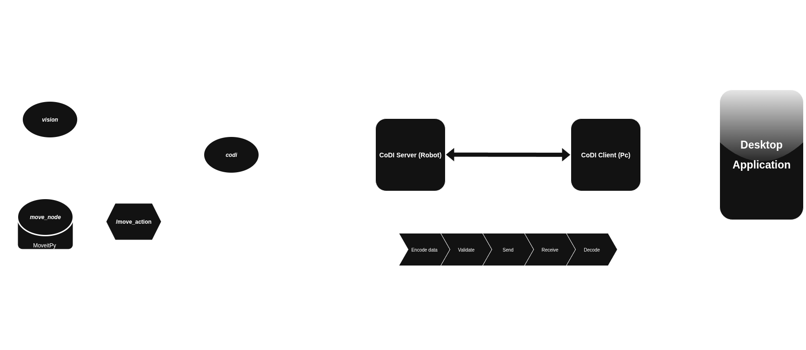

# CORA Robot


ROS 2 Packages for the real cora robot.

## ROS 2 Topics


## Project Structure

```lua
cora_bringup
cora_codi
cora_description
cora_gripper_1_description
cora_moveit
cora_moveit_config
cora_msgs
cora_vision
odrive_base
odrive_ros2_control
```

## Launch files
> Some of these launch files allow specifying the gripper description package to use. See Adding a custom gripper for usage
### bringup.launch.py
minimal robot launch file. 
- Launch Contents:
    * `codi_node`
    * `move.launch.py`
    * `vision.launch.py` 
- Parameters
    * `use_codi`
    * `hardware_type`
    * `gripper_package`

### move.launch.py
launches all moveit related ros 2 nodes.
- Launch Contents:
    * `move_group_node`
    * `moveit_py_node`
    * `servo_node`
    * `robot_state_publisher`
    * `ros2_control_node`
    * `rviz_node`
    * `static_tf`
- Parameters
    * `gripper_package`
    * `hardware_type`

### vision.launch.py
- Launch Contents:
    * camera_node
    * aruco_node

## Adding a custom gripper
1. Make sure the package structure is as follows:
    ```lua
    gripper_description/
        meshes/
        urdf/
            cora_gripper.urdf
            cora_gripper.urdf.xacro
            cora_gripper.ros2_control.xacro
    ```
    The main cora urdf expects a gripper urdf called 'cora_gripper.urdf.xacro'. If the file name is different, xacro raises an error and the robot description will not load.

2. Wrap all contents of the xacro file in `<xacro:macro/>` tags with name `cora_gripper_xacro`, so the main urdf can instantiate it properly. 

3. Add correct joint names. `Finger1` for the main finger and `Finger2` for the mimic.

4. Add correct fixed joints and dummy links for the moveit pipeline to use. `Gripper` and `Camera` for the links and `Gripper_frame` and `Camera_frame` for the fixed joints.

5. Add name, initial positions and hardware_type as parameters.
    
*Examples*:
* cora_gripper.urdf.xacro
```xml
    <?xml version="1.0"?>
    <robot xmlns:xacro="http://www.ros.org/wiki/xacro" name="cora_gripper">

    <xacro:macro name="cora_gripper_xacro" params="hardware_type initial_positions_file">

        <!-- Store gripper package path -->
        <xacro:property
            name="gripper_package_path"
            value="$(find cora_gripper_description)"/>

        <!-- Include gripper file using absolute path -->
        <xacro:include filename="${gripper_package_path}/urdf/cora_gripper.urdf" />
        <xacro:cora_gripper />

        <!-- Include control xacro -->
        <xacro:include filename="${gripper_package_path}/urdf/cora_gripper.ros2_control.xacro" />
        <xacro:cora_gripper_ros2_control
            name="GripperSystem"
            initial_positions_file="${initial_positions_file}"
            hardware_type="${hardware_type}"/>
    </xacro:macro>

    </robot>
```
* cora_gripper.ros2_control.xacro
    ```xml
    <?xml version="1.0"?>
    <robot xmlns:xacro="http://www.ros.org/wiki/xacro">
        <xacro:macro name="cora_gripper_ros2_control" params="name initial_positions_file hardware_type">
            <xacro:property name="initial_positions" value="${xacro.load_yaml(initial_positions_file)['initial_positions']}"/>

            <ros2_control name="${name}" type="system">

                <hardware>
                <!-- By default, set up controllers for fake system-->
                <xacro:if value="${hardware_type == 'Fake'}">
                    <plugin>mock_components/GenericSystem</plugin> <!-- Mock Components -->
                </xacro:if>

                <!-- Real Hardware Components -->
                <xacro:if value="${hardware_type == 'Real'}">
                    <plugin>gripper_1_ros2_control_plugin/GripperHardwareInterface</plugin>
                    <param name="can">can0</param>
                </xacro:if>
                </hardware>

                <joint name="Finger1">
                    <command_interface name="position"/>
                    <command_interface name="velocity"/>
                    <state_interface name="position">
                    <param name="initial_value">${initial_positions['Finger1']}</param>
                    </state_interface>
                    <state_interface name="velocity"/>
                    <param name="node_id">6</param>
                </joint>

            </ros2_control>
        </xacro:macro>
    </robot>

    ```

* cora_gripper.urdf
```xml
    <?xml version="1.0" ?>
    <robot xmlns:xacro="http://www.ros.org/wiki/xacro">
        <xacro:macro name="cora_gripper">

            <!-- Link gripper_body -->
            <link name="gripper_body">
                <inertial>
                <origin xyz="0 0 0" rpy="0 0 0"/>
                <mass value="1e-09"/>
                <inertia ixx="1e-09" ixy="0" ixz="0" iyy="1e-09" iyz="0" izz="1e-09"/>
                </inertial>
                <!-- Part gripper_body_parts -->
                <visual>
                <origin xyz="-7.4681e-15 -1.17217 -0.059" rpy="-1.5708 -1.5708 0"/>
                <geometry>
                    <mesh filename="package://cora_gripper_1_description/meshes/merged/gripper_body_visual.stl"/>
                </geometry>
                <material name="gripper_body_parts_material">
                    <color rgba="0.4 0.4 0.4 1.0"/>
                </material>
                </visual>
                <collision>
                <origin xyz="-7.4681e-15 -1.17217 -0.059" rpy="-1.5708 -1.5708 0"/>
                <geometry>
                    <mesh filename="package://cora_gripper_1_description/meshes/merged/gripper_body_collision.stl"/>
                </geometry>
                </collision>
            </link>

            <!-- Frame Gripper (dummy link + fixed joint) -->
            <link name="Gripper">
                <origin xyz="0 0 0" rpy="0 -0 0"/>
                <inertial>
                <origin xyz="0 0 0" rpy="0 0 0"/>
                <mass value="1e-9"/>
                <inertia ixx="0" ixy="0" ixz="0" iyy="0" iyz="0" izz="0"/>
                </inertial>
            </link>
            <joint name="Gripper_frame" type="fixed">
                <origin xyz="-1.75447e-17 0 -0.112" rpy="-3.14159 1.57702e-16 -1.11972e-30"/>
                <parent link="gripper_body"/>
                <child link="Gripper"/>
                <axis xyz="0 0 0"/>
            </joint>

            <!-- Frame Camera (dummy link + fixed joint) -->
            <link name="Camera">
                <origin xyz="0 0 0" rpy="0 -0 0"/>
                <inertial>
                <origin xyz="0 0 0" rpy="0 0 0"/>
                <mass value="1e-9"/>
                <inertia ixx="0" ixy="0" ixz="0" iyy="0" iyz="0" izz="0"/>
                </inertial>
            </link>
            <joint name="Camera_frame" type="fixed">
                <origin xyz="0.016614 0.0515 -0.0460957" rpy="-3.14159 3.23996e-14 3.14159"/>
                <parent link="gripper_body"/>
                <child link="Camera"/>
                <axis xyz="0 0 0"/>
            </joint>

            <!-- Link gripper_fingers -->
            <link name="gripper_fingers">
                <inertial>
                <origin xyz="0 0 0" rpy="0 0 0"/>
                <mass value="1e-09"/>
                <inertia ixx="1e-09" ixy="0" ixz="0" iyy="1e-09" iyz="0" izz="1e-09"/>
                </inertial>
                <!-- Part gripper_fingers_parts -->
                <visual>
                <origin xyz="1.17667 0.0095 0.07" rpy="-1.5708 -1.2413e-09 1.5708"/>
                <geometry>
                    <mesh filename="package://cora_gripper_1_description/meshes/merged/gripper_fingers_visual.stl"/>
                </geometry>
                <material name="gripper_fingers_parts_material">
                    <color rgba="0.4 0.4 0.4 1.0"/>
                </material>
                </visual>
                <collision>
                <origin xyz="1.17667 0.0095 0.07" rpy="-1.5708 -1.2413e-09 1.5708"/>
                <geometry>
                    <mesh filename="package://cora_gripper_1_description/meshes/merged/gripper_fingers_collision.stl"/>
                </geometry>
                </collision>
            </link>

            <!-- Joint from gripper_body to gripper_fingers -->
            <joint name="Finger1" type="prismatic">
                <origin xyz="0.07 0.0045 -0.0685" rpy="1.5708 -2.55351e-15 -1.5708"/>
                <parent link="gripper_body"/>
                <child link="gripper_fingers"/>
                <axis xyz="0 0 1"/>
                <limit effort="10" velocity="10" lower="0.0" upper="0.0385"/>
            </joint>

            <!-- Link gripper_fingers_2 -->
            <link name="gripper_fingers_2">
                <inertial>
                <origin xyz="0 0 0" rpy="0 0 0"/>
                <mass value="1e-09"/>
                <inertia ixx="1e-09" ixy="0" ixz="0" iyy="1e-09" iyz="0" izz="1e-09"/>
                </inertial>
                <!-- Part gripper_fingers_2_parts -->
                <visual>
                <origin xyz="-1.16767 0.0095 0.07" rpy="1.5708 1.2413e-09 1.5708"/>
                <geometry>
                    <mesh filename="package://cora_gripper_1_description/meshes/merged/gripper_fingers_2_visual.stl"/>
                </geometry>
                <material name="gripper_fingers_2_parts_material">
                    <color rgba="0.4 0.4 0.4 1.0"/>
                </material>
                </visual>
                <collision>
                <origin xyz="-1.16767 0.0095 0.07" rpy="1.5708 1.2413e-09 1.5708"/>
                <geometry>
                    <mesh filename="package://cora_gripper_1_description/meshes/merged/gripper_fingers_2_collision.stl"/>
                </geometry>
                </collision>
            </link>

            <!-- Joint from gripper_body to gripper_fingers_2 -->
            <joint name="Finger2" type="prismatic">
                <origin xyz="-0.07 -0.0045 -0.0685" rpy="1.5708 5.4956e-15 1.5708"/>
                <parent link="gripper_body"/>
                <child link="gripper_fingers_2"/>
                <axis xyz="0 0 1"/>
                <limit effort="10" velocity="10" lower="0.0" upper="0.0385"/>
                <mimic joint="Finger1" multiplier="1.0"/>
            </joint>

            <!-- Joint from endeffector to gripper_body -->
            <joint name="GripperFix" type="fixed">
                <origin xyz="4.44089e-16 3.45864e-19 -0.024" rpy="-6.10623e-15 4.51028e-15 1.5708"/>
                <parent link="endeffector"/>
                <child link="gripper_body"/>
                <axis xyz="0 0 1"/>
                <limit effort="10" velocity="10"/>
            </joint>

        </xacro:macro>
    </robot>
```


